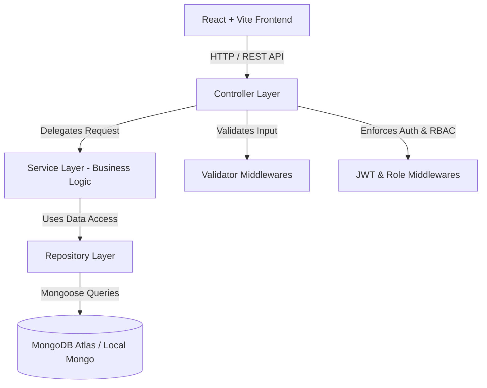

# Car Dealership Inventory System

[](https://github.com/krishborad/IncuByte)
[](https://www.typescriptlang.org/)
[](https://nodejs.org/)
[](https://react.dev/)
[](LICENSE)

A production-grade, full-stack **Car Dealership Inventory System** built using strict Test-Driven Development (TDD) principles (RED → GREEN → REFACTOR). Featuring a Node.js + Express + TypeScript + MongoDB backend architecture and a modern React + Vite + Tailwind CSS frontend interface.

---

## 📋 Table of Contents
- [Project Overview](#-project-overview)
- [Architecture](#-architecture)
- [Tech Stack](#-tech-stack)
- [Folder Structure](#-folder-structure)
- [Environment Variables](#-environment-variables)
- [Installation](#-installation)
- [Running Locally](#-running-locally)
- [API Documentation](#-api-documentation)
- [Testing](#-testing)
- [UX, Responsiveness & Accessibility](#-ux-responsiveness--accessibility)
- [Deployment](#-deployment)
- [Screenshots](#-screenshots)
- [AI Usage & Prompt Log](#-ai-usage--prompt-log)
- [Troubleshooting](#-troubleshooting)
- [Contribution](#-contribution)
- [License](#-license)

---

## 🚗 Project Overview
The Car Dealership Inventory System provides full-stack inventory management, authentication, role-based access control, search, multi-attribute filtering, inventory restocking, soft-deletion, and atomic vehicle purchasing.

### Key Capabilities
- **Customer Portal**: Search by global keywords, filter by make, fuel type, transmission, sort by price/year/date, view real-time availability badges, and complete instant online vehicle purchases.
- **Admin Dashboard**: Manage inventory with full CRUD operations, live statistics cards (total listings, inventory valuation, out-of-stock items, low-stock alerts), inventory table with inline actions, restock modal dialogs, soft-deletion safety, and modal vehicle creation/editing with image file uploads and instant preview.
- **Security & Authorization**: JWT-based stateless authentication, bcrypt password hashing, pre-save hooks, role-based access control (`admin`, `customer`), input validation with schemas, and centralized domain error handling.

---

## 🏗️ Architecture
The system adheres to SOLID software design principles and clean modular architecture:



### Core Design Patterns
1. **Repository Pattern**: Decouples Mongoose database operations from business logic, ensuring testability and mockability.
2. **Service Layer**: Encapsulates business constraints (e.g. atomic inventory decrementing, out-of-stock prevention, duplicate email checks).
3. **Controller & Validator Layers**: Pure HTTP interface handlers and pre-route schema validation.
4. **Domain Exception Handling**: Custom typed domain errors (`NotFoundError`, `BadRequestError`, `UnauthorizedError`, `ForbiddenError`, `ConflictError`) translated by a centralized error middleware.

---

## 🛠️ Tech Stack

### Backend
- **Runtime**: Node.js (v18+)
- **Framework**: Express.js with TypeScript
- **Database & ORM**: MongoDB Atlas / Local MongoDB, Mongoose ODM
- **Authentication**: JSON Web Tokens (JWT), bcrypt password hashing
- **Testing**: Jest, Supertest

### Frontend
- **Framework**: React 18, Vite
- **Styling**: Tailwind CSS, Vanilla CSS Glassmorphism
- **Routing**: React Router v6 (Protected & Admin Route Guards)
- **State & Forms**: React Context API, React Hook Form
- **HTTP Client**: Axios with Request/Response Interceptors
- **Testing**: Jest, React Testing Library (RTL), `@testing-library/user-event`

---

## 📁 Folder Structure

```text
d:\Incubyte\
├── backend/
│   ├── src/
│   │   ├── config/          # Database configuration (db.ts)
│   │   ├── controllers/     # Controller layer (auth, vehicle)
│   │   ├── middlewares/     # JWT authentication, role authorization, centralized error handler
│   │   ├── models/          # Mongoose data schemas (User, Vehicle)
│   │   ├── repositories/    # Data access layer (user.repository, vehicle.repository)
│   │   ├── routes/          # API Route definitions (auth.routes, vehicle.routes)
│   │   ├── services/        # Service layer (auth.service, vehicle.service)
│   │   ├── tests/           # Unit & Integration Jest test suites
│   │   ├── utils/           # Typed domain error classes (errors.ts), JWT helpers
│   │   ├── validators/      # Input validation schemas (auth, vehicle)
│   │   └── app.ts / server.ts # Express app setup & server initialization
│   ├── tsconfig.json
│   ├── jest.config.ts
│   └── package.json
│
└── frontend/
    ├── src/
    │   ├── components/      # Reusable UI components (Navbar, Footer, VehicleCard, VehicleFormModal)
    │   ├── contexts/        # Auth Context & Provider
    │   ├── hooks/           # Custom React hooks (useAuth)
    │   ├── layouts/         # Page layout wrappers (MainLayout)
    │   ├── pages/           # Application views (HomePage, AdminDashboardPage, LoginPage, RegisterPage)
    │   ├── routes/          # Route Guards (ProtectedRoute, AdminRoute)
    │   ├── services/        # Axios API services (api.ts, auth.service, vehicle.service)
    │   ├── tests/           # React Testing Library unit & integration tests
    │   ├── types/           # TypeScript data interfaces
    │   └── App.tsx / main.tsx
    ├── tsconfig.json
    ├── tailwind.config.js
    ├── jest.config.cjs
    └── package.json
```

---

## 🔑 Environment Variables

### Backend (`backend/.env`)
Create a `.env` file inside the `backend/` directory based on `.env.example`:

```env
PORT=5000
NODE_ENV=development
MONGO_URI=mongodb://localhost:27017/car_dealership
JWT_SECRET=your_super_secret_jwt_key_here
JWT_EXPIRES_IN=1d
```

### Frontend (`frontend/.env`)
Create a `.env` file inside the `frontend/` directory:

```env
VITE_API_BASE_URL=http://localhost:5000/api
```

---

## ⚡ Installation

### Prerequisites
- Node.js (v18.0.0 or higher)
- npm (v9.0.0 or higher)
- MongoDB instance (local server or MongoDB Atlas URI)

### Step-by-Step Setup

1. **Clone the Repository**:
   ```bash
   git clone https://github.com/krishborad/IncuByte.git
   cd IncuByte
   ```

2. **Install Backend Dependencies**:
   ```bash
   cd backend
   npm install
   ```

3. **Install Frontend Dependencies**:
   ```bash
   cd ../frontend
   npm install
   ```

---

## 🚀 Running Locally

### 1. Start Database
Ensure your MongoDB service is running locally on port `27017` or update `MONGO_URI` in `backend/.env` with your MongoDB Atlas connection string.

### 2. Start Backend Server
From the `backend/` directory:
```bash
npm run dev
```
The backend server will launch at `http://localhost:5000`.

### 3. Start Frontend App
From the `frontend/` directory:
```bash
npm run dev
```
The React frontend application will launch at `http://localhost:5173`.

---

## 📡 API Documentation

### Base URL
`http://localhost:5000/api`

### 🔒 Authentication Routes (`/api/auth`)

| Method | Endpoint | Access | Description |
| :--- | :--- | :--- | :--- |
| `POST` | `/auth/register` | Public | Register new user (`name`, `email`, `password`, `role`) |
| `POST` | `/auth/login` | Public | Authenticate user & return JWT token (`email`, `password`) |
| `GET` | `/auth/me` | Authenticated | Fetch currently logged-in user profile (`Bearer <token>`) |
| `GET` | `/auth/admin-only` | Admin Only | Protected admin sanity route |

### 🚗 Vehicle Routes (`/api/vehicles`)

| Method | Endpoint | Access | Description |
| :--- | :--- | :--- | :--- |
| `GET` | `/vehicles` | Public | Fetch paginated, filtered, & sorted inventory list |
| `POST` | `/vehicles` | Admin Only | Add new vehicle to dealership inventory |
| `PUT` | `/vehicles/:id` | Admin Only | Update vehicle parameters & pricing |
| `DELETE` | `/vehicles/:id` | Admin Only | Soft delete vehicle listing (`isDeleted: true`) |
| `POST` | `/vehicles/:id/restock` | Admin Only | Restock vehicle inventory quantity (`+qty`) |
| `POST` | `/vehicles/:id/purchase` | Authenticated | Purchase vehicle & atomically decrement stock |

#### `GET /api/vehicles` Query Parameters
- `search` / `q`: Keyword search across `make`, `model`, and `description`.
- `page`: Page number (default: 1).
- `limit`: Items per page (default: 6, max: 100).
- `sortBy`: Field to sort (`price`, `year`, `mileage`, `createdAt`).
- `sortOrder`: `asc` or `desc`.
- `make` / `model`: Specific manufacturer or model search.
- `minPrice` / `maxPrice`: Price range filters.
- `minYear` / `maxYear`: Manufacture year range filters.
- `fuelType`: Enum filter (`Gasoline`, `Diesel`, `Electric`, `Hybrid`, `Plug-in Hybrid`).
- `transmission`: Enum filter (`Automatic`, `Manual`, `CVT`, `Dual-Clutch`).

---

## 🧪 Testing

The repository maintains **100% test pass rate** with 106 automated unit and integration tests across backend and frontend suites.

### Running Backend Tests
From the `backend/` directory:
```bash
npm test
```
- Includes 75 tests covering DB connection, JWT generation, User model pre-save hooks, UserRepository, AuthService, AuthController, Auth Middlewares, Vehicle model validation, VehicleRepository, VehicleService, and API route controllers.

### Running Frontend Tests
From the `frontend/` directory:
```bash
npm test
```
- Includes 31 tests covering Smoke sanity, Navbar mobile toggle & auth state, ProtectedRoute guards, LoginPage validation & submission, RegisterPage validation, VehicleCard stock badges & purchase modal, HomePage search/filter/pagination integration, VehicleFormModal form validation & image preview, and AdminDashboardPage statistics & CRUD tables.

---

## 🎨 UX, Responsiveness & Accessibility

- **Accessibility (a11y)**: Built with semantic HTML5 elements, explicit `aria-label`, `aria-expanded`, `aria-required`, `aria-invalid`, `role="dialog"`, `role="alert"`, `role="status"`, `aria-live="polite"` feedback regions, and high-contrast visible focus rings.
- **Responsiveness**: Fully fluid mobile-first layouts with touch-friendly targets (`min-h-[44px]`), collapsible mobile navigation drawers, and overflow-x table scrolling.
- **User Feedback**: Non-blocking auto-dismissing toast notifications for purchase, restock, edit, create, and delete actions.

---

## 🌐 Deployment

### Backend Deployment (e.g., Render, Railway)
1. Set Environment Variables on host platform (`PORT`, `MONGO_URI`, `JWT_SECRET`, `NODE_ENV=production`).
2. Build command: `npm run build`
3. Start command: `node dist/server.js`

### Frontend Deployment (e.g., Vercel, Netlify)
1. Set `VITE_API_BASE_URL` pointing to backend live API URL.
2. Build command: `npm run build`
3. Publish directory: `dist`

---

## 🖼️ Screenshots

```carousel

<!-- slide -->

<!-- slide -->

```

---

## 🤖 AI Usage & Prompt Log

This project was built pair-programming with **Antigravity (Google DeepMind)** using strict Test-Driven Development (TDD). Every prompt, architectural decision, test execution outcome, and code change is appended chronologically in [PROMPTS.md](PROMPTS.md).

---

## 🔧 Troubleshooting

### Common Setup Issues & Solutions

1. **MongoDB Connection Failed (`MongooseServerSelectionError`)**:
   - Verify local MongoDB service is running (`mongod` / MongoDB Windows Service) or verify your IP is whitelisted in MongoDB Atlas.

2. **CORS / API Requests Blocked**:
   - Ensure the backend server is running at port `5000` and `VITE_API_BASE_URL` in frontend matches `http://localhost:5000/api`.

3. **Jest Test Timeout Errors**:
   - Ensure you run tests using `npm test` which sets `WaitMsBeforeAsync` and mocks database network calls deterministically.

---

## 🤝 Contribution
Contributions are welcome! Please follow these guidelines:
1. Fork the repository.
2. Create a feature branch: `git checkout -b feature/amazing-feature`
3. Ensure all tests pass: `npm test` in both `backend` and `frontend`.
4. Commit your changes: `git commit -m 'feat: add amazing feature'`
5. Push to branch: `git push origin feature/amazing-feature`
6. Open a Pull Request.

---

## 📄 License
This project is licensed under the **MIT License** - see the [LICENSE](LICENSE) file for details.
